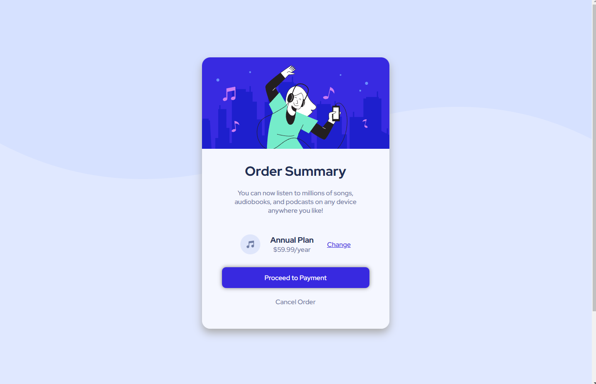
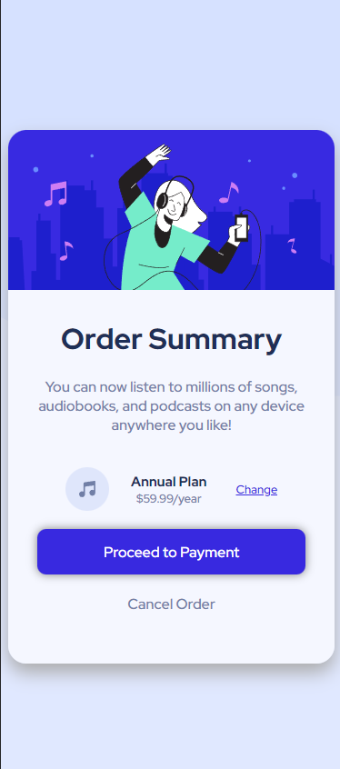

# Frontend Mentor - Order summary card solution

This is a solution to the [Order summary card challenge on Frontend Mentor](https://www.frontendmentor.io/challenges/order-summary-component-QlPmajDUj). Frontend Mentor challenges help you improve your coding skills by building realistic projects. 

## Table of contents

- [Overview](#overview)
  - [The challenge](#the-challenge)
  - [Screenshot](#screenshot)
  - [Links](#links)
- [My process](#my-process)
  - [Built with](#built-with)
  - [What I learned](#what-i-learned)
  - [Continued development](#continued-development)
  - [Useful resources](#useful-resources)
- [Author](#author)
- [Acknowledgments](#acknowledgments)

## Overview

### The challenge

Users should be able to:

- See hover states for interactive elements

### Screenshot
The screenshots were taken in the widths indicaded by the challange (1440x, 375px)

### Links
- Live Site URL: [https://morbitdemon.github.io/order-summary-component-main/)

## My process
- Built the HTML structure.
- Builded the Desktop Design.
- Made little changes for portrait mode.
### Built with

- Semantic HTML5 markup
- CSS custom properties
- Flexbox
- Desktop-first workflow*

### What I learned
Learned how to make responsive images more easily.
### Continued development

- Responsive design and layouts

### Useful resources

- [Responsive img](https://www.freecodecamp.org/news/css-responsive-image-tutorial/) - This helped me undertand how to make a image responsive the correct way.
- [Eliminate space between img and div](https://www.freecodecamp.org/news/css-responsive-image-tutorial/) - This helped me eliminate a space between an img an a DIV.

## Author

- Frontend Mentor - [@MorbitDemon](https://www.frontendmentor.io/profile/MorbitDemon)
